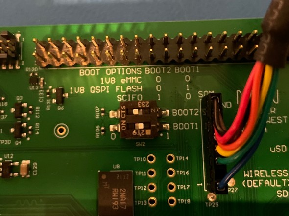

# Board Start-Up Guide MistySOM

### Revision History

<table>
  <tr>
   <td>Version
   </td>
   <td>Description of Changes
   </td>
   <td>Date
   </td>
  </tr>
  <tr>
   <td>
	   1.0
   </td>
   <td>
	   Initial Version
   </td>
   <td>
	   12/07/2022
   </td>
  </tr>
  <tr>
    <td>
	   1.1
   </td>
   <td>
	   Added links to Flash Writer & bootloader files
   </td>
   <td>
	   01/04/2023
   </td>
  </tr>
</table>

### Requirements
- **For Windows:**
  - TerasTerm (link to download)
- **For Linux:**
  - root permissions (sudo)
  - (use your distributuion's package manager to install the following utilities):
    - screen
    - dd
    - pv

### Booting Flash Writer
1. Set the boot mode to SCIF. On the MistySOM Carrier board, on SW2, set BOOT1 OFF and BOOT2 to ON.

   
3. Connect the `FTDI cable` to `J40` on the MistyCarrier board and a USB port on the computer
4. **On Windows:**
	- Start TeraTerm and select the `COMn: USB Serial Port (COMn)` interface.
	- Set the Baud rate under `Setup -> Serial Port... -> Speed:` to `115200` and click the `New Setting` button.

   **On Linux:** Open a terminal and run the command: `sudo screen /dev/ttyUSB0 115200`
6. Power on the MistySOM board.
7. Upon application of power, you should see the following on your terminal window:   
      ```SCIF Download mode
        (C) Renesas Electronics Corp.
      -- Load Program to SystemRAM ---------------
      please send !  
      ```  
7. Download and save the file `Flash_Writer_SCIF__.mot`([MistySOM-G2L](../files/bootloader/rzg2l/Flash_Writer_SCIF_RZG2L.mot) or [MistySOM-V2L](../files/bootloader/rzv2l/Flash_Writer_SCIF_RZV2L.mot)) by clicking on **Raw** button and then using **Save as** over the opened content.
8. **In TeraTerm** (on Windows): Select `File -> Send File...` and select the file `Flash_Writer_SCIF__.mot`. A transfer dialog will appear displaying the progress of the file transfer over the serial connection. <br/>
   **On Linux:** Open another terminal window and run the command: `pv Flash_Writer_SCIF__.mot | sudo dd of=/dev/ttyUSB0`
   
After successful downloading of the binary, Flash Writer starts automatically and shows a message like the one shown below on the terminal
```
Flash writer for RZ/V2 Series V1.02 Nov.15,2021
 Product Code : RZ/V2L
>
```

### Writing Bootloader

For the boot operation, two boot loader files need to be written to the target board.<br>
Type `XLS2` and confirm with [ENTER]:<br>
Enter the top address `11E00`<br>
and the Qspi address `00000`:
```
>XLS2
===== Qspi writing of RZ/G2 Board Command =============
Load Program to Spiflash
Writes to any of SPI address.
Micron : MT25QU512
Program Top Address & Qspi Save Address
===== Please Input Program Top Address ============
Please Input : H'11E00
===== Please Input Qspi Save Address ===
Please Input : H'00000
Work RAM(H'50000000-H'53FFFFFF) Clear....
please send ! ('.' & CR stop load)
```
Send the data of “`bl2_bp-MistySOMG2L.srec`” (download for [MistySOM-G2L](../files/bootloader/rzg2l/bl2_bp-MistySOMG2L.srec) or [MistySOM-V2L](../files/bootloader/rzv2l/bl2_bp-MistySOMV2L.srec)) from terminal software after the message “please send !” is shown.

After successful download of the binary, messages like below are shown on the terminal.
```
SPI Data Clear(H'FF) Check :H'00000000-0000FFFF Erasing..Erase Completed
SAVE SPI-FLASH.......
======= Qspi Save Information =================
SpiFlashMemory Stat Address : H'00000000
SpiFlashMemory End Address : H'00009A80
===========================================================

SPI Data Clear(H'FF) Check : H'00000000-0000FFFF,Clear OK?(y/n)
```
In case a message prompt to clear data like above appears, please enter “y”.


Next, write another loader file by using `XLS2` command again.<br>
With top address `00000`<br> 
and Qspi address `1D200`:
```
>XLS2
===== Qspi writing of RZ/G2 Board Command =============
Load Program to Spiflash
Writes to any of SPI address.
Micron : MT25QU512
Program Top Address & Qspi Save Address
===== Please Input Program Top Address ============
Please Input : H'00000
===== Please Input Qspi Save Address ===
Please Input : H'1D200
Work RAM(H'50000000-H'53FFFFFF) Clear....
please send ! ('.' & CR stop load)
```
Send the data of “`fip-MistySOMG2L.srec`”(download for [MistySOM-G2L](../files/bootloader/rzg2l/fip-MistySOMG2L.srec) or [MistySOM-V2L](../files/bootloader/rzv2l/fip-MistySOMV2L.srec)) from terminal software after the message “please send !” is shown.

After successful download of the binary, messages like below are shown on the terminal.
```
SPI Data Clear(H'FF) Check :H'00000000-0000FFFF Erasing..Erase Completed
SAVE SPI-FLASH.......
======= Qspi Save Information =================
SpiFlashMemory Stat Address : H'0001D200
SpiFlashMemory End Address : H'000CC73F

SPI Data Clear(H'FF) Check : H'00000000-0000FFFF,Clear OK?(y/n)
```
In case a message to prompt to clear data like above appears, please enter “y”.


After writing two loader files normally, turn off the power of the board and set SW2 into QSPI boot mode:
* BOOT1 ON
* BOOT2 OFF
  
  


### Configure U-Boot

Reapply power to the board and turn it on with the `PWR_ON` switch.<br/>
The following will appear on the terminal::
```
þÿNOTICE:  BL2: v2.5(release):v2.5/rzg2l-1.00-49-g7b68034f7
NOTICE:  BL2: Built : 18:44:43, Dec  7 2022
NOTICE:  BL2: Booting BL31
NOTICE:  BL31: v2.5(release):v2.5/rzg2l-1.00-49-g7b68034f7
NOTICE:  BL31: Built : 18:44:43, Dec  7 2022


U-Boot 2021.10-g8a08fc7390 (Dec 07 2022 - 10:44:16 -0800)

CPU:   Renesas Electronics K rev 16.15
Model: smarc-rzg2l
DRAM:  1.9 GiB
MMC:   sd@11c00000: 0, sd@11c10000: 1
Loading Environment from MMC... *** Warning - bad CRC, using default environment

In:    serial@1004b800
Out:   serial@1004b800
Err:   serial@1004b800
Net:   No ethernet found.

Hit any key to stop autoboot:  0
## Resetting to default environment
Card did not respond to voltage select! : -110
** No partition table - mmc 0 **
Couldn't find partition mmc 0:1
Can't set block device
** No partition table - mmc 0 **
Couldn't find partition mmc 0:1
Can't set block device
Error: Bad gzipped data
Bad Linux ARM64 Image magic!
=>
``` 
the bottom prompt `=>` indicates the U-Boot prompt.
Enter 
```
=> env default -a
## Resetting to default environment
=> saveenv
Saving Environment to MMC... Writing to MMC(0)....OK
=>
```
to reset the values to a defined default state, ready for custom configuration.

After the SDcard has been prepared and inserted, set the boot variables on U-boot prompt with:
```
=> setenv bootcmd 'mmc dev 1;fatload mmc 1:1 0x48080000 Image;fatload mmc 1:1 0x48000000 r9a07g044l2-smarc.dtb; booti 0x48080000 - 0x48000000'
=> setenv bootargs 'root=/dev/mmcblk1p2 rootwait'
```
Confirm with 
```
=> saveenv
```
power cycle the board and it should now boot up to a Linux prompt where you an login with root
```
Poky (Yocto Project Reference Distro) 3.1.14 smarc-rzg2l ttySC0

smarc-rzg2l login: root
```


