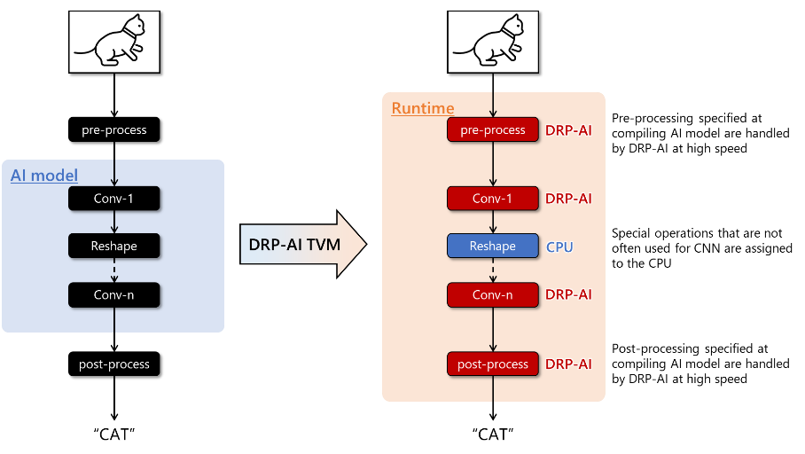

# Convert an existing model to MistySOM V2L

## DRP-AI TVM Makes It Easy to Port AI Model into RZ/V Devices

Have you ever found it difficult to implement an AI model in an embedded device? 
I would like to introduce DRP-AI TVM[^1] for easy porting of AI models.

In recent years, the implementation of AI in embedded devices such as surveillance cameras, traffic monitoring systems, robots, and drones has been increasing. Unlike the cloud environment, embedded devices have many considerations such as HW performance and restrictions in cost and power consumption, making AI implementation difficult. By using the AI-MPU RZ/V series, which implements Renesas' low-power AI accelerator DRP-AI, most of the hardware implementation issues can be resolved.

When users implement AI models into MPUs, they can use the DRP-AI translator to convert AI models into DRP-AI executable format. However, we received feedback from some users about the difficulty of implementation.

The main reasons are two.

1. AI model format supported by the DRP-AI translator is ONNX only.
2. If non-supported AI model operators are included in AI models, the DRP-AI translator cannot convert it into an executable format.

Renesas has asked users to handle such cases themselves, which has caused a burden on some users. Edgecortix[^2] released DRP-AI TVM to solve the issues and to improve user experience.

DRP-AI TVM is the tool that added DRP-AI support on an open-source ML compiler Apache TVM[^3]. Using DRP-AI TVM, AI model operators non-supported by DRP-AI translator can be automatically allocated to CPUs to implement more AI models into RZ/V products easily. DRP-AI TVM supports not only ONNX, and other AI frameworks such as Poarch and TensorFlow, etc.

Furthermore, as with the conventional DRP-AI translator flow, DRP-AI can handle the pre-processing of AI inference, enabling total AI performance improvement, including pre-processing.

  

  <strong>DRP-AI TVM structure</strong>   

  <strong>Auto AI model operators’ allocation by DRP-AI TVM</strong>   

DRP-AI TVM is public on GitHub for users to ease access. Users can find sufficient information to use DRP-AI TVM on GitHub, such as the tutorial, sample code, and a variety of AI model performances. The tutorial includes steps from building the environment to AI inference on an evaluation board, and customers can use these steps to evaluate their AI models easily. Renesas will continue to strive for UX improvements to make it easier for customers to use Renesas products.

[^1]: DRP-AI TVM is powered by Edgecortix MERATM Compiler Framework
[^2]: EdgeCortix MERA
[^3]: [Apache TVM](https://tvm.apache.org) 
&nbsp;

[RZ/V series introduction](https://www.renesas.com/us/en/products/microcontrollers-microprocessors/rz-mpus/rzv-embedded-ai-mpus) 
[Renesas info wiki RZ/V series](https://renesas.info/wiki/RZ-V) 
[DRP-AI introduction](https://www.renesas.com/us/en/application/key-technology/artificial-intelligence/ai-accelerator-drp-ai) 
[DRP-AI TVM GitHub](https://github.com/renesas-rz/rzv_drp-ai_tvm) 
[DRP-AI TVM Tutorial](https://www.renesas.com/us/en/application/key-technology/artificial-intelligence/ai-accelerator-drp-ai/ai-tool-drp-ai-tvm) 
 source: [DRP-AI TVM Makes It Easy to Port AI Model into RZ/V Devices](https://www.renesas.com/us/en/blogs/drp-ai-tvm-makes-it-easy-port-ai-model-rzv-devices)
