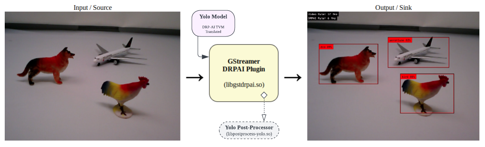

# Video Inference with DRPAI and GStreamer

MistySOM RZV2L contains the DRPAI hardware module which is able to run artificial Neural Networks 
with the focus on low power consumption. To check if this hardware module is present on your device,
you can look for both `/dev/drpai0` and `/dev/udmabuf0` devices on your Linux shell. 
The Userland Direct Memory Access (UDMA) kernel module is required to provide the trained AI model and 
the input image to the DRPAI hardware. After activating the hardware, it will use the trained model to
generate the output which can be read by the UDMA module. While DRPAI is running, the running thread will
go to sleep. Of course, the sleep time varies based on the size of the AI model.

MistyWest team has prepared a [GStreamer plugin for DRPAI](https://github.com/MistySOM/gstreamer1.0-drpai) which can receive any kind of video input,
such as a file (filesrc), a network stream (udpsrc), or a camera device (v4l2src) and outputs a video 
with bounding boxes on inferred objects using the DRPAI. Later, this video can be linked to any kind of 
output, such as the display (autovideosink), a network stream (udpsink), or a file (filesink).



The plugin uses the following pad template capabilities for both **src** and **sink** which requires you
to prepare before your DRPAI element (for example, using a `videoconvert` element):

```
video/x-raw
    width: 640
    height: 480
    format: BGR
```

The plugin also provides you with the following parameters:

| Name                  | Type                | Default | Description                                                          |
|-----------------------|---------------------|--------:|----------------------------------------------------------------------|
| **model**             | String              |     --- | The name of the pre-trained model and the directory prefix.          |
| **multithread**       | Boolean             |    true | Use a separate thread for object detection.                          |
| **log-detects**       | Boolean             |   false | Print detected objects in standard output.                           |
| **show-fps**          | Boolean             |   false | Render frame rates of video and DRPAI at the corner of the video.    |
| **stop-error**        | Boolean             |    true | Stop the gstreamer if kernel modules fail to open.                   |
| **max-video-rate**    | Float [0.001 - 120] |     120 | Force maximum video frame rate using thread sleeps.                  |
| **max-drpai-rate**    | Float [0 - 120]     |     120 | Force maximum DRPAI frame rate using thread sleeps.                  |
| **smooth-video-rate** | Float [1 - 1000]    |       1 | Number of last video frame rates to average for a more smooth value. |
| **smooth-drpai-rate** | Float [1 - 1000]    |       1 | Number of last DRPAI frame rates to average for a more smooth value. |

## AI Model

The plugin is implemented in a way that it can run different models. By using the `model` parameter, 
you can switch between different DRP-AI translated models that are located in a directory with 
the same name as the model. For example, when using the parameter `model=yolov3`, and you are running
the command on your home directory `/home/user`, the plugin loads the TVM compiled model located in
`/home/user/yolov3`.

### Post Processor Dynamic Library

Depending on the model you use, even though their input layers are the same, their output layers can be
very different and require additional post-processing to interpret the array of floating point numbers
to a data structure that is used to render the bounding boxes for each inferred object. Therefore, 
the plugin uses a shared library that needs to be included with the model and its path is mentioned in 
the `{model}/{model}_process_params.txt` file like this:
```
[dynamic_library]
libpostprocess-yolo.so
.
.
.
```

#### Yolo Post-Processor Library (libpostprocess-yolo.so)

The plugin already includes a post-processor library that supports `yolov2`, `yolov3`, `tinyyolov2`, 
and `tinyyolov3` models. This post-processor library leverages many similarities between these models and
switches its behaviour based on other parameters that are mentioned in `{model}/{model}_process_params.txt` 
file such as the `[best_class_prediction_algorithm]` and `[anchor_divide_size]`. 

The library also loads the list of all class labels in `{model}/{model}_labels.txt` and the list of all 
box anchors in `{model}/{model}_anchors.txt`. This means these 3 files need to be manually included 
alongside the output of the DRPAI TVM translator.

If you want to use a model that is not following the output layer format for Yolo models, it is possible to
write your own post-processor library. Please refer to the plugin's 
[source code](https://github.com/MistySOM/gstreamer1.0-drpai).

## Some examples of running GStreamer with the DRPAI
### Read Camera and Show on Screen

```
gst-launch-1.0 v4l2src device=/dev/video0 \
    ! videoconvert \
    ! drpai model=yolov3 show-fps=true log-detects=true smooth-video-rate=30 \
    ! videoconvert \
    ! autovideosink
```
If your camera supports the BGR format (such as the coral camera), you can modify the camera size in 
`~/v4l2init.sh` and skip the first `videoconvert` element like this:
```
gst-launch-1.0 v4l2src device=/dev/video0 ! video/x-raw, width=640, height=480, format=BGR \
    ! drpai model=yolov3 show-fps=true log-detects=true smooth-video-rate=30 \
    ! videoconvert \
    ! autovideosink
```
### Read Camera and Stream on Network

In case you already have the streaming working based on [here](StreamingVideo.md), you can 
add the drpai element to the `stream.sh` file like this:

````
#!/bin/bash
[ $1 ] || { echo  "Please specify the destination IP address: ./stream.sh ip" >&2; exit 1; }

./v4l2-init.sh
echo "Streaming to ${1} with DRPAI..."

gst-launch-1.0 v4l2src device=/dev/video0 ! video/x-raw, width=640, height=480, format=BGR \
    ! drpai model=yolov3 show-fps=true log-detects=true smooth-video-rate=30 \
    ! vspmfilter dmabuf-use=true ! video/x-raw, format=NV12 \
    ! omxh264enc control-rate=2 target-bitrate=10485760 interval_intraframes=14 periodicty-idr=2 \
    ! video/x-h264,profile=\(string\)high,level=\(string\)4.2 \
    ! rtph264pay config-interval=-1 ! udpsink host=$1 port=51372
````
