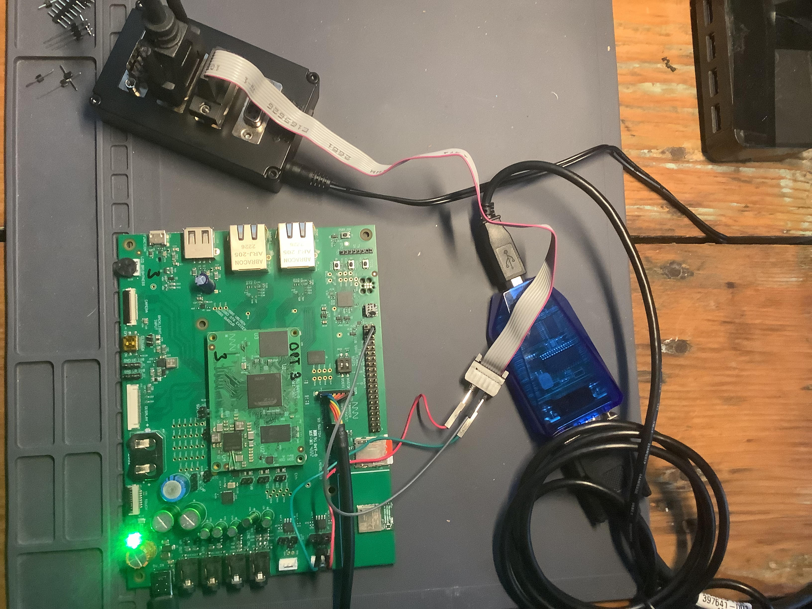
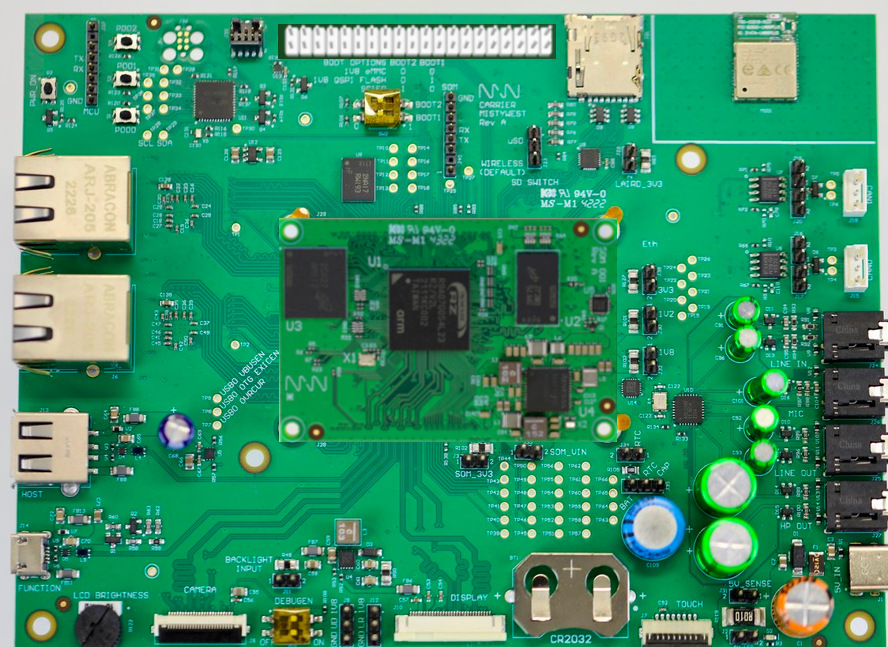
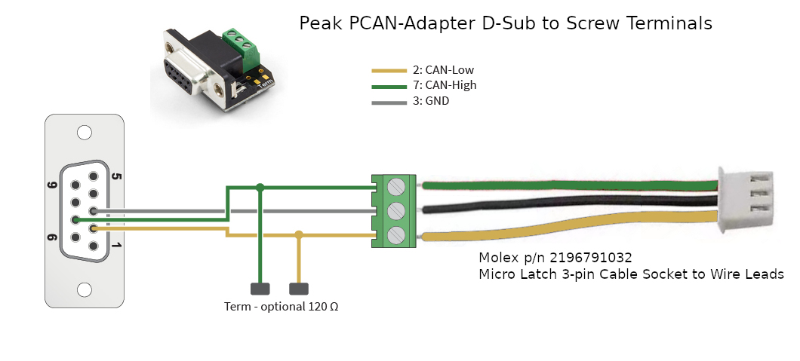
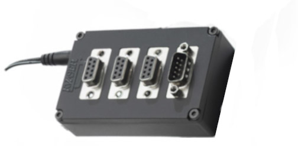
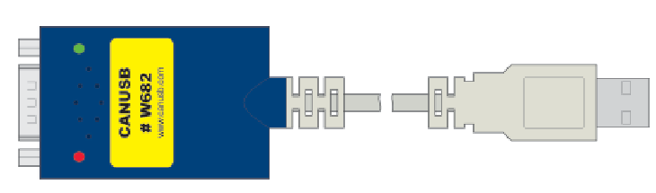
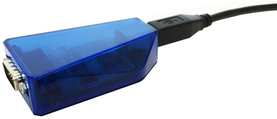
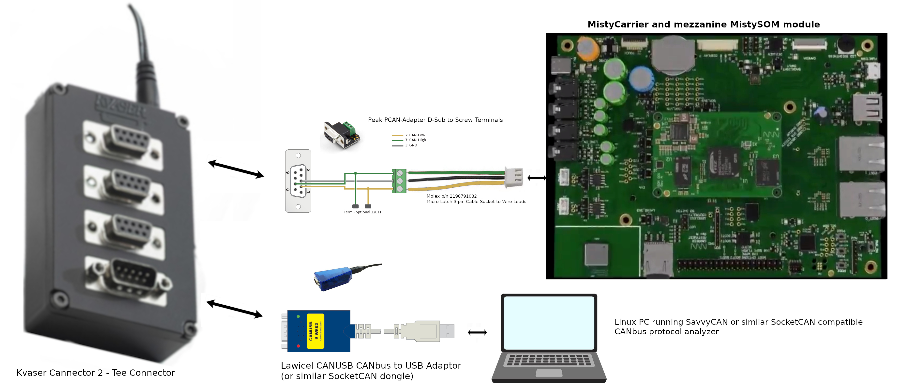
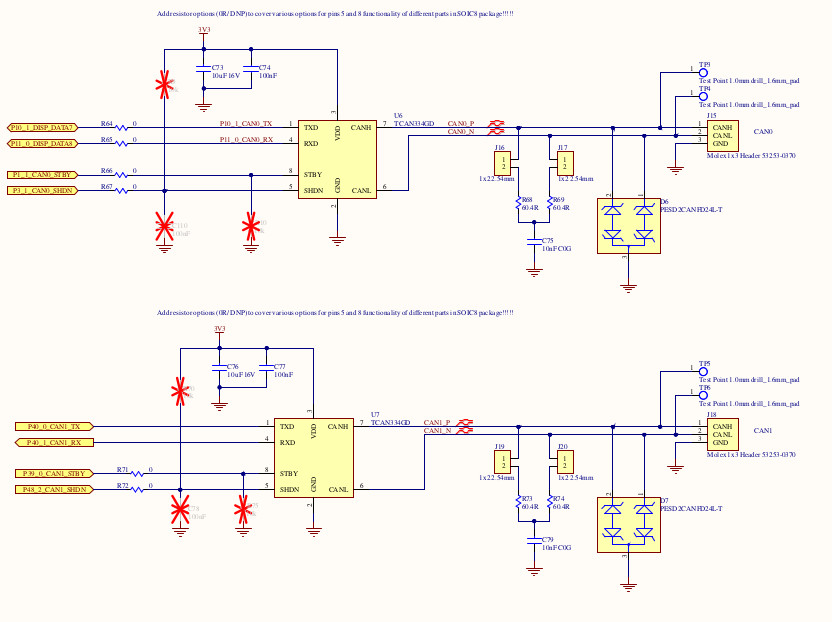

# How To Set Up Socket CAN Interface


# Introduction

The purpose of this tutorial is to demonstrate using the MistySOM Carrier board with a mezzanine MistySOM RZ/G2L module (shown in Fig. 1 below) to read and write data over CANbus  to  a Linux PC running a SocketCAN CANbus protocol analyzer such as SavvyCAN.


|  |
| ------------------------------------------------------------ |
| Fig. 1 - Test Setup for reading and writing to CanBus from MistySOM RZ/G2L |


## Materials:

- **MistyWest MistySOM EVK Kit** (based on  a MistySOM module using a Renesas RZ/G2L or RZ/V2L microcontroller  as a mezzanine module mounted on MistyCarrier). Make sure the MistySOM board boots from a micro SD Card running the latest MistySOM-specific RZ/G2L or RZ/V2L V3.0.x  Linux image. A standard break-away 0.1" 2x20-pin dual male header should be soldered to the MistyCarrier J4 i/o pads if not populated. Refer to Fig 2 below.

|  |
| ------------------------------------------------------------ |
| Fig 2 - MistyWest EVK Kit with MistySOM mezzanine RZ/G2L module hosted on MistyCARRIER board. |

- **Standard +3.3V FTDI TTL-232R-3V3-2MM USB to UART serial cable** (https://ftdichip.com/products/ttl-232r-3v3/) connecting the 1x8-pin keyed J40 connector on the MistyCarrier to a USB 2.0 Type-A port on a host Linux or Windows PC. Refer to the image in Fig 3 below.

|      |
| -------------------------------------------------- |
| Fig 3 - FTDI TTL-232R-3V3 USB to UART serial cable |

- **Terminal emulator software** running on host PC for a serial terminal console session  (e.g picocom, minicom on a Linux PC or puTTY, TeraTerm on a Windows PC).

- **Molex Latch 3-pin Cable Socket to Wire Leads (p/n 2196791032) (one for each of CAN0 and CAN1 ports)** Molex 3-wire PigTail connections for each of Ports CAN0 and CAN1 on MistyCarrier board. Refer to Fig 4 below showing Molex pigtail as connected to PEAK PCAN-Adapter D-Sub connector screw terminals.


|  |
| ------------------------------------------------------------ |
| Fig. 4 - Close-up of Molex Pigtail connector attached to PEAK PCAN-Adapter DB-9 D-Sub adapter |

- **Peak PCAN-Adapter D-Sub to Screw Terminals Pigtail connector (p/n IPEK-003025) (one for each set of Molex Latch 3-pin pigtail wire leads for CAN0 and CAN1 ports) ** - Refer to Fig 4 above showing Molex pigtail as connected to PEAK PCAN-Adapter D-Sub connector screw terminals. Optional 120-ohm termination jumpers are not installed since CAN termination is installed on the MistyCARRIER board.

- **Kvaser T-CANnector V2 (p/n 73-30130-00776-5)** - The T-CANnector V2 serves as a DB-9 CANbus hub with 3 female and 1 male DB-9 connectors. Refer to Fig 5 below. Each of the PEAK PCAN-Adapter terminals for the CAN0 and CAN1 ports from the MistyCarrier can connect to the T-CANnector hub. All peer devices connected to the CAN segment on the Kvaser T-CANnector V2 hub can communicate with each other.

|            |
| ---------------------------------------------------- |
| Fig 5 - Kvaser T-CANnector V2 (p/n 73-30130-00776-5) |


- **Lawicel CANUSB CAN to USB Interface Converter**

The Lawicel CANUSB interface (refer to Fig 6 below) is a relatively inexpensive CAN-to-USB dongle that plugs into any PC USB Port and gives SocketCAN connectivity to a host Linux PC. This means it can be treated by software as a standard COM Port (virtual serial RS232 port) with the FTDI USB drivers which eliminates the need for any extra drivers (DLL) or optionally by installing a direct driver DLL (D2XX) together with the CANUSB DLL for faster communications and higher CAN bus loads. The Lawicel CANUSB converter should be connected to the P4 DSUB-9 plug port on the Kvaser T-CANnector V2 (rather than the P1, P2 or P3 DSUB-9 socket connectors). Also, the switch for the 120 ohm termination resistor on the  Kvaser T-CANnector V2 hub should be enabled to establish termination for the Lawicel adapter at it's end of the CANbus segment.

|  |
| -------------------------------------------------------- |
|                |
| Fig. 6 - Lawicel CANUSB CAN to USB Adaptor Dongle        |


- **SavvyCAN CAN analyzer software for Linux** - SavvyCAN (https://www.savvycan.com/) is a cross-platform QT-based CAN bus capture and analysis software tool (supported on Linux) which is able to use any socketCAN compatible device. SavvyCAN can use any CAN interface supported by QT's SerialBus system (PeakCAN, Vector, SocketCAN, Lawicel CANUSB, J2534, etc). It can capture and send to multiple buses and CAN capture devices at once. SavvyCAN has many functions specifically meant for reverse engineering data found on the CAN bus:

  \- Ability to capture even very highly loaded buses

  \- Ability to connect to many dongles simultaneously

  \- Scan captured traffic for data that looks coherent

  \- Show ASCII of captured data to find things like VIN numbers and traffic to and from the radio

  \- Graph data found on the bus

  \- Load and Save many different file formats common to CAN capture tools (Vector captures, Microchip, CANDo, PCAN, and many more)

  \- Load and Save DBC files. DBC files are used to store definitions for how data are formatted on the bus. You can turn the raw data into things like RPM, odometer readings, and more.

  \- UDS scanning and decoding

  \- Scripting interface to be able to expand the scope of the software

### MistyCarrier RZ/G2L interface for reading and writing to CANbus


|  |
| ------------------------------------------------------------ |
| Fig. 7 - Test Setup for reading and writing to CanBus from MistySOM RZ/G2L |


|          |
| ------------------------------------------------------------ |
| Fig 8 - MistyCarrier schematic showing CAN0 and CAN2 Molex 1x3 Headers at right.<br />NOTE: Jumpers J16 and J17 (for CAN0 termination) or J19 and J20 (for CAN1 termination) should be installed if the corresponding MistyCAN canbus port is the end of the CAN cable segment. |


## Test Procedure Using SocketCAN and iproute2 tools for RZ/G2L and RZ/V2L


## Purpose

This article describes how to set up a SocketCAN interface using the iproute2 suite of tools and is included in the RZ/G2L and RZ/V2L SDK.

iproute2 is a set of utilities for Linux networking, including support for SocketCAN interfaces.


## Configuring the SocketCAN interface

You can display available network interfaces to find out the available CAN devices:

```
$ ifconfig -a
can0      Link encap:UNSPEC  HWaddr 00-00-00-00-00-00-00-00-00-00-00-00-00-00-00-00
          NOARP  MTU:16  Metric:1
          RX packets:0 errors:0 dropped:0 overruns:0 frame:0
          TX packets:0 errors:0 dropped:0 overruns:0 carrier:0
          collisions:0 txqueuelen:10
          RX bytes:0 (0.0 B)  TX bytes:0 (0.0 B)
          Interrupt:30

eth0      Link encap:Ethernet  HWaddr 00:80:E1:42:45:EC
.
.
.
```

Configure the available SocketCAN interface using the ip link command line as follow:

```
$ ip link set can0 type can bitrate 1000000 dbitrate 2000000 fd on
[ 24.700698] m_can 4400e000.can can0: bitrate error 0.3%
[ 24.704568] m_can 4400e000.can can0: bitrate error 1.6%

```

To list CAN user-configurable options, use the following command line:

```
$ ip link set can0 type can help

Usage: ip link set DEVICE type can
        [ bitrate BITRATE [ sample-point SAMPLE-POINT] ] |
        [ tq TQ prop-seg PROP_SEG phase-seg1 PHASE-SEG1
          phase-seg2 PHASE-SEG2 [ sjw SJW ] ]

        [ dbitrate BITRATE [ dsample-point SAMPLE-POINT] ] |
        [ dtq TQ dprop-seg PROP_SEG dphase-seg1 PHASE-SEG1
          dphase-seg2 PHASE-SEG2 [ dsjw SJW ] ]
    
        [ loopback { on | off } ]
        [ listen-only { on | off } ]
        [ triple-sampling { on | off } ]
        [ one-shot { on | off } ]
        [ berr-reporting { on | off } ]
        [ fd { on | off } ]
        [ fd-non-iso { on | off } ]
        [ presume-ack { on | off } ]
    
        [ restart-ms TIME-MS ]
        [ restart ]
    
        Where: BITRATE  := { 1..1000000 }
                  SAMPLE-POINT  := { 0.000..0.999 }
                  TQ            := { NUMBER }
                  PROP-SEG      := { 1..8 }
                  PHASE-SEG1    := { 1..8 }
                  PHASE-SEG2    := { 1..8 }
                  SJW           := { 1..4 }
                  RESTART-MS    := { 0 | NUMBER }

### 
```

### Displaying SocketCAN status

To get a detailed status of the SocketCAN link, use the following command line:

$ ip -details link show can0
2: can0: <NOARP,ECHO> mtu 72 qdisc pfifo_fast state DOWN mode DEFAULT group default qlen 10
    link/can  promiscuity 0
    can <FD> state STOPPED (berr-counter tx 0 rx 0) restart-ms 0
          bitrate 996078 sample-point 0.745
          tq 19 prop-seg 18 phase-seg1 19 phase-seg2 13 sjw 1
          m_can: tseg1 2..256 tseg2 1..128 sjw 1..128 brp 1..512 brp-inc 1
          dbitrate 2032000 dsample-point 0.720
          dtq 19 dprop-seg 8 dphase-seg1 9 dphase-seg2 7 dsjw 1
          m_can: dtseg1 1..32 dtseg2 1..16 dsjw 1..16 dbrp 1..32 dbrp-inc 1
          clock 50800000numtxqueues 1 numrxqueues 1 gso_max_size 65536 gso_max_segs 65535

## Enabling/disabling the SocketCAN interface

Then enable the connection by bringing the SocketCAN interface up:

```
$ ip link set can0 up
```

You can check that the interface is up by printing the netlink status:

```
 $ ip -details link show can0
2: can0: <NOARP,UP,LOWER_UP,ECHO> mtu 72 qdisc pfifo_fast state UNKNOWN mode DEFAULT group default qlen 10
    link/can  promiscuity 0
    can <FD> state ERROR-ACTIVE (berr-counter tx 0 rx 0) restart-ms 0
          bitrate 996078 sample-point 0.745
...

```

You can disable the connection by bringing the SocketCAN interface down. This command is useful when you need to reconfigure the SocketCAN interface:

```
 $ ip link set can0 down
 
```

## Loopback test mode

It is possible to configure the SocketCAN in internal Loopback test mode. In that case, the FDCAN treats its own transmitted messages as received messages. This mode can be used for hardware self-test:

```
 $ ip link set can0 type can bitrate 1000000 dbitrate 2000000 fd on loopback on
```

You can check that the loopback option is on by printing the netlink status:

```
 $ ip  -details link show can0
2: can0: <NOARP,ECHO> mtu 72 qdisc pfifo_fast state DOWN mode DEFAULT group default qlen 10
    link/can  promiscuity 0
    can <LOOPBACK,FD> state STOPPED (berr-counter tx 0 rx 0) restart-ms 0
          bitrate 996078 sample-point 0.745

```
## CAN Test
Connect Saleae to `CANL` and bring the device up with the following two instructions:
```
# ip link set can0 type can bitrate 1000000 dbitrate 2000000 fd on
# ip link set can0 up
```
then invoke [cangen](https://manpages.debian.org/stretch-backports/can-utils/cangen.1.en.html) to create example traffic with:
```
# cangen can0 -D 11223344DEADBEEF -L 8
```
While [cansniffer]([https://manpages.debian.org/testing/can-utils/candump.1.en.htmhttps://manpages.debian.org/testing/can-utils/cansniffer.1.en.htmll](https://manpages.debian.org/testing/can-utils/cansniffer.1.en.html)) can be used to monitor incoming traffic:
* for example with a loopback cable to the `can1` interface:
```
# cansniffer can1
```
or with a connection to `can0` on a second board:
```
# cansniffer can0
```

## Example of SocketCAN interface setup

You can configure and enable the SocketCAN interface in the same command line:

```
$ ip link set can0 up type can bitrate 1000000 dbitrate 2000000 fd on
[ 24.700698] m_can 4400e000.can can0: bitrate error 0.3%
[ 24.704568] m_can 4400e000.can can0: bitrate error 1.6%
[ 24.710140] IPv6: ADDRCONF(NETDEV_CHANGE): can0: link becomes ready

the repertoire of socketcan commands

root@smarc-rzg2l:~# history
    1  ifconfig -a
    2  ip link set can1 type can bitrate 125000 dbitrate 250000 fd on
    3  ip link set can1 up
    4  ip -details link show can1
    5  cangen can1
    6  ip link set can1 down
    7  ip -details link show can1
    8  ip link set can1 up
    9  cangen can1
   10  ip link set can1 up
   11  ip -details link show can1
   12  ip link set can1 up
   13  ip -details link show can1
   14* 
   15  candump can1
   16  which candump
   17  ip -d -s link show can1
   18  ip link set can1 down
   19  ip link set can1 type can bitrate 125000 dbitrate 250000 berr-reporting on fd on
   20  ip link set can1 up
   21  ip -details link show can1
   22  fg
   23  jobs
   24  ip link set can1 down
   25  ip link set can1 up
   26  ip -details link show can1
   27  history
   28  cangen can1
   29  ip -details link show can1
   30  cangen can1 &
   31  ip -details link show can1
   32  ip -d -s link show can1
   33  dmesg -n 7
   34  ip -d -s link show can1
   35  dmesg | less
   36  ip link set can1 down
   37  ip link set can1 downjobs
   38  jobs
   39  ip link set can1 type can bitrate 125000 dbitrate 4000000 berr-reporting on fd off
   40  ip link set can1 type can bitrate 125000 berr-reporting on fd off
   41 ip link set can1 type can bitrate 125000 berr-reporting on fd on
   42  ip link set can1 type can bitrate 125000 berr-reporting on
   43  ip link set can1 down
   44  ip -d -s link show can1
   45  ip link set can1 type can bitrate 125000
   46  ip -d -s link show can1
   47  cangen can1 &
   48  ip link set can1 up
   49  cangen can1 &
   50  ip -d -s link show can1
   51  ip link set can1 type can bitrate 125000 berr-reporting on
   52  jobs
   53  fg 1
   54  ip link set can1 down
   55  ip link set can1 type can bitrate 125000 berr-reporting on
   56  ip link set can1 up
   57  cangen can1
   58  candump can1
   59  ip -d -s link show can1
   60  ip link -help
   61  ip link help
   62  candump -h
   63  candump -c -c -x -e -ta can1
   64  canfdtest
   65  canfdtest -vv can1
   66  canfdtest 
   67  canfdtest -g -vv can1
   68  tmux
   69  cangen can1 &
   70  candump can1
   71  jobs
   72  fg 1
   73  canbusload can1
   74  canbusload can1@125000 -r -t -b -c
   75  canbusload
   76  canbusload can1@125000 -r -t -b -c -e
   77  ip -d -s link show can1
   78  history


```

## Troubleshooting & FAQ

error experienced:
```
ifconfig can0 txqueuelen 1000
```
can be resolved with:
```
# ifconfig can0 txqueuelen 1000
```
This will increase the number of frames allowed per kernel transmission queue for the queuing discipline. More info [here](https://community.carloop.io/t/socketcan-canplayer-error-sendto-no-buffer-space-available/298)


