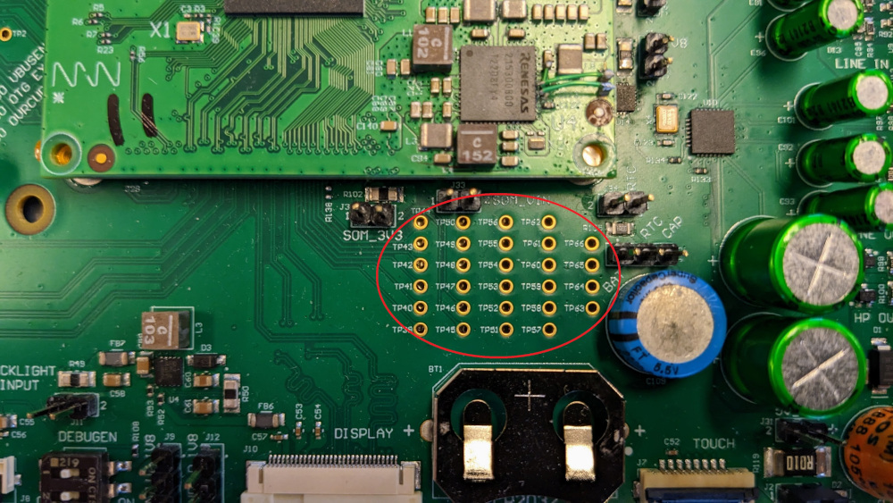

# Using GPIO on MistySOM and MistyCarrier to Test Toggling a LED With Libgpiod Utilities

## Introduction
The ultimate purpose of this tutorial and test procedure is to demonstrate that selected digital General Purpose Input-Output (GPIO) pins on the MistySOM Carrier board have proper continuity and are fully functional for control of external digital i/o devices. Specifically, the procedure outlined here explains how the GPIO pins  on the MistyCarrier board with a RZ/G2L MistySOM module can be used to toggle a LED on an attached breadboard by using the standard Linux libgpiod command line utilities which are provided in the Renesas VLP 3.0.x Linux RZ/G2L build with the custom MistySOM yocto Board Support Package. Individual pins on both the 40-pin J4 connector and debug pads for TP test pins can each be individually be connected and used to toggle the LED using the corresponding .sh shell script file which uses the libgpiod gpioset and gpiofind utilities.

|  |
| ------------------------------------------------------------ |
| Fig. 1 - MistySOM Carrier Board with Simple GPIO Test Setup Connection to LED Breadboard Circuit |


## Materials:

**MistyWest MistySOM EVK Kit** (based on  a MistySOM module using a Renesas RZ/G2L or RZ/V2L microcontroller  as mezzanine module mounted on MistyCarrier). Make sure the MistySOM board boots from a micro SD Card running the latest MistySOM-specific RZ/G2L or RZ/V2L V3.0.x  Linux image. A standard break-away 0.1" 2x20-pin dual male header should be soldered to the MistyCarrier J4 i/o pads if not populated. 

**Standard +3.3V FTDI TTL-232R-3V3-2MM USB to UART serial cable** (https://ftdichip.com/products/ttl-232r-3v3/) connecting the 1x8-pin keyed J40 connector on the MistyCarrier to a USB 2.0 Type-A port on a host Linux or Windows PC.


**Terminal emulator software** running on host PC for a serial terminal console session  (e.g picocom, minicom on a Linux PC or puTTY, TeraTerm on a Windows PC).

**Breadboard** - Standard 0.1" solderless electronic prototyping breadboard with 400 or 800 tie-points with bus strip rows for power and ground rails. 

**Jumper Wires** - standard F/F jumper wires with female connectors on both ends. Use these to jumper from any male header on the MistyCarrier board to any other pin on the prototyping breadboard. The LED toggle procedure verifies one  GPIO pin at a time connected by a jumper to a single pin on header J4 (see Fig 3-4 below) or else a pin on from one of test points TP39-TP66 on the debug pads of the MistyCarrier (see Fig 6-9 below).

**Jumper Pins** - assorted 0.1" breakaway rectangular jumper pins for connecting jumpers to breadboard

**Resistor** - A standard 330Ω carbon-film resistor colour code Orange-Orange-Brown-Gold). Used as current-limiting or ballast resistor attached to anode of LED diode. A 330Ω value is conservative and should provide a reasonable LED intensity without crossing the forward-based junction voltage threshold allowing excessive current flow. 

**LED** - One standard 5mm through-hole Red or Green LED Diode rated for 1.8 to 3.1 Vf forward voltage (turn-on level) and 20mA current

## Circuit

Refer to Fig 2 below showing the connector soldered to the J4 dual-row 2x20-pin header at the top centre of the image. 
The schematic for the MistySOM signals on this J4 connector is provided in Fig 3, and the mapping of the RZ/G2L Pin Mux functions to the pins is provided on Fig. 4 (or on [GPIO pins](GPIOPins.md)). Finally Fig 5 shows an example of a Fritzing breadboard diagram of connecting the 3.3V J4 header pin 40 (3v3 RZ/G2L GPIO pin P43_3)  via the 330Ω resistor to the LED anode.  The LED cathode is connected indirectly to pin 4 GND on the J4 header via the GND rail on the breadboard. Toggling the LED on and off is covered in the test procedure section further below. For testing GPIO pin P43_3 on J4 pin 40, the corresponding gpio_J4_pin_40_toggle
script is used to toggle the LED on and off 3 times at 1-second intervals.  For testing other GPIO signals on the J4 header, the jumper should be reconnected to the desired GPIO header pin, and the corresponding [gpio_J4_pin_NN_toggle.sh](https://github.com/MistySOM/aux/tree/master/gpio) should be invoked from the command line. 

|  |
| ------------------------------------------------------------ |
| Fig 2 - MistyCarrier with mezzanine MistySOM showing J4 2x20-pin header at top center |

|  |
| ------------------------------------------------------------ |
| Fig. 3 - MistyCarrier J4 Connector schematic pinout for pins 1-40 with available GPIO signal subset |

|  |
| ------------------------------------------------------------ |
| Fig. 4 - Mapping of MistyCarrier J4 Header pinout to Available GPIO RZ/G2L pins on func0 pin mux selection |

|  |
| ------------------------------------------------------------ |
| Fig. 5 - Breadboard Circuit Image of J4 pin 40 (3v3 RZ/G2L GPIO pin P43_3) connected via resistor to LED anode. |

The schematic for the MistySOM GPIO signals on the Test Points TP39-TP66 debug pads in provided in Fig 6 below, and the mapping of the RZ/G2L Pin Mux functions to the TPnn test point pins is provided in Fig. 7 (or on [GPIO pins](GPIOPins.md)). Pictures of the Debug Pad Test Points on the MistyCarrier are shown in Fig 8 and Fig. 9. For testing the LED toggling of the debug test points, each TPnn pin is iteratatively or successively connected via the 330Ω resistor to the LED anode.  As previously, the LED cathode is connected indirectly to pin 4 GND on the J4 header via the GND rail on the breadboard. Toggling the LED on and off is covered in the test procedure section further below. For example, to test test point TP39 (GPIO P7_2), the gpio_debug-pad_TP39_toggle.sh script is used to toggle the LED on and off 3 times at 1-second intervals.  For testing other GPIO signals on the TP39-TP66 debug Test Points, the jumper should be reconnected to the desired TPnn header pin, and the corresponding  [gpio_debug-pad_TP39_toggle.sh](https://github.com/MistySOM/aux/tree/master/gpio/gpio_debug-pad_TP39_toggle.sh) script should be invoked from the command line.

|  |
| ------------------------------------------------------------ |
| Fig. 6 - MistyCarrier Debug Pads TP39 to TP66 - Schematic excerpt |

|  |
| ------------------------------------------------------------ |
| Fig. 7 - MistyCarrier Debug Pads TP39 to TP66 - GPIO PinMux Mapping for mux option func0 (GPIO) |

|                         |
| ------------------------------------------------------------ |
| Fig. 8 - Position of Test Point TP39-TP66 Debug Pads on MistyCarrier |

|         |
| ------------------------------------------------------------ |
| Fig. 9 - Close-up Image of Test Point TP39-TP66 Debug Pads on MistyCarrier |


## Test Procedure Using libgpiod tools

The `libgpiod` GPIO device library package for Linux is a user-mode C library and also a set of command tools for interacting with the Linux GPIO character device. This library encapsulates the `ioctl()` calls and data structures using a straightforward API. The respective Renesas RZ/G2L or RZ/V2L images encapsulating the MistySOM-specific kernel image and BPS board support library already contain the libgpiod package in the build image, and the appropriate Device Tree definitions for pinctrl pin muxing. For more information see: https://git.kernel.org/pub/scm/libs/libgpiod/libgpiod.git/about/.

## Libgpiod Command Line Tools:

For the purposes of toggling a LED using GPIO, we only will need to use the libgpiod CLI tools from the Bash shell. In the past, GPIO was accessed by the Shell from the sysfs interface. As of Linux version 4.8, this use has been deprecated. The six command line tools in `libgpiod`are a better way to access the libgpiod driver API via the shell.

- **gpiodetect**: list all gpiochips present on the system, their names, labels, and number of GPIO lines
- **gpioinfo**: list all lines of specified gpiochips, their names, consumers, direction, active state, and additional flags
- **gpioget**: read values of specified GPIO lines
- **gpioset**: set values of specified GPIO lines, potentially keep the lines exported and wait until timeout, user input or signal
- **gpiofind**: find the gpiochip name and line offset given the line name
- **gpiomon**: wait for events on GPIO lines, specify which events to watch, how many events to process before exiting or if the events should be reported to the console

### `libgpiod` Examples

1) **gpiodetect**: To find out which GPIO banks and how many GPIO lines are available on the hardware.
   For MistySOM RZ/G2L version and MistyCarrier:
   
   ```
   root@smarc_rzg2l:/# gpiodetect
   gpiochip0 [11030000.pin-controller] (392 lines)
   gpiochip1 [sx1502q] (8 lines)
   gpiochip2 [sx1502q] (8 lines)
   ```

   
   The gpiochip0 bank is used for the internal on-chip RZ/G2L SoC peripheral which has 392 lines. The gpiochip1 and gpiochip2 banks are used respectively with two Semtech SX1502q i2c GPIO port expanders to read 8 GPIO pins in each bank for the MistySOM PCB board revision bit values (gpiochip1) and MistyCarrier PCB board revision bit values (gpiochip2). Discussion of configuring and reading these PCB revision resistor bit values is outside the scope of this GPIO LED toggle application note.
   
2. **gpioinfo**: List all lines of specified gpiochips, their names, direction, active state and additional flags

   ```
   root@smarc-rzg2l:/# gpioinfo gpiochip0
       gpiochip0 - 392 lines:
   
       line   0:       "P0_0" "gpio_hdr_pin33" output active-high [used]
       line   1:       "P0_1" "gpio_hdr_pin35" output active-high [used]
       line   2:       "P0_2"       unused   input  active-high
       line   3:       "P0_3"       unused   input  active-high
       line   4:       "P0_4"       unused   input  active-high
       line   5:       "P0_5"       unused   input  active-high
       line   6:       "P0_6"       unused   input  active-high
       line   7:       "P0_7"       unused   input  active-high
       line   8:       "P1_0" "gpio_hdr_pin37" output active-high [used]
       line   9:       "P1_1"       unused   input  active-high
       line  10:       "P1_2"       unused   input  active-high
       line  11:       "P1_3"       unused   input  active-high
   .
   .
       line 383:      "P47_7"       unused   input  active-high
       line 384:      "P48_0" "gpio_hdr_pin11" output active-high [used]
       line 385:      "P48_1" "gpio_hdr_pin21" output active-high [used]
       line 386:      "P48_2"       unused   input  active-high
       line 387:      "P48_3" "gpio_hdr_pin23" output active-high [used]
       line 388:      "P48_4" "gpio_hdr_pin25" output active-high [used]
       line 389:      "P48_5"       unused   input  active-high
       line 390:      "P48_6"       unused   input  active-high
       line 391:      "P48_7"       unused   input  active-high
   ```

3) **gpiofind**: Find the gpiochip name and line offset given the line name.
   
   `root@smarc-rzg2l:/# gpiofind "P48_0"`

   ​    `gpiochip0 384`

      

4. **gpioset**: Set the values of specified GPIO lines. gpioset expects the bank, gpiochip, GPIO line and the value to be set, 1 for HIGH and 0 for LOW active-high standard

   ⚠ Note: gpioset (and all libgpiod apps) will **revert the state** of a GPIO line back to its **original value when it exits**. For this reason if you want the state to persist you need to instruct gpioset to wait for a signal and optionally detach and run in the background.

   Display help for the gpioset command:

   ```
   # gpioset --help
   Usage: gpioset [OPTIONS]  = = ...
   Set GPIO line values of a GPIO chip
   Options:
     -h, --help:           display this message and exit
     -v, --version:        display the version and exit
     -l, --active-low:     set the line active state to low
     -m, --mode=[exit|wait|time|signal] (defaults to 'exit'):
                   tell the program what to do after setting values
     -s, --sec=SEC:        specify the number of seconds to wait (only valid for --mode=time)
     -u, --usec=USEC:      specify the number of microseconds to wait (only valid for --mode=time)
     -b, --background:     after setting values: detach from the controlling terminal
     
   Modes:
     exit:         set values and exit immediately
     wait:         set values and wait for user to press ENTER
     time:         set values and sleep for a specified amount of time
     signal:       set values and wait for SIGINT or SIGTERM
   ```

   Examples:

   ```
   root@smarc-rzg2l:/# gpioset gpiochip0 384=1   ### Set line 384 of gpiochip0 to 1 (but it will also immediately go back to 0)
   root@smarc-rzg2l:/# gpioset --mode=signal --background gpiochip0 384=1   ### Set pin to 1, but continue to run in the background so the pin will stay high or 1
   root@smarc-rzg2l:/# gpioset --mode=time --sec=1 gpiochip0 384=0  ### toggle the pin for 1 sec
   root@smarc-rzg2l:/# gpioset --mode=wait gpiochip0 384=0 ### toggle pin & wait for press ENTER
   ```

      

5) **gpioset and gpiofind combination**: Set values of GPIO by using gpiofind to lookup the signal name to find the pin offset in the bank.

   E.G. To toggle MistyCarrier J4 pin 19 (GPIO P48_0), instead of using

   ​    gpioset --mode=time --sec=1 384=1

   we can instead use the command

   ​    gpioset --mode=time --sec=1 \`gpiofind "P48_0"\`=1

   In this example, gpiofind is used to lookup GPIO pin P48_0 to return the offset 384 which is passed as the bank pin offset parameter to the gpioset command.   All of the  gpio_J4_pin\_*nn*\_toggle.sh and gpio_debug-pad_TP*nn*_toggle.sh scripts toggle LEDs using this parameter lookup trick to determine the correct pin offset to pass to the gpioset commands.

## Using GPIO LED Toggle Scripts:

To make use of the GPIO LED toggle scripts, perform the following steps:

1. Determine which GPIO pin you wish to test from either the 40-pin J4 header or else the TPnn Debug test points (refer to the [GPIO pins](GPIOPins.md) page).

2. Connect the jumper attached to the 3V3 end of the series current limiting resistor connected to the LED anode to the  desired pin (either on J4 header or on desired TP test point).

3. Invoke the corresponding test script toggling the LED using the corresponding GPIO pin.

   For the J4 40-pin header, use one of the gpio_J4_pin_nn_toggle.sh scripts.  For example, we can toggle the LED using J4 pin 40 using the script command:
   `root@smarc-rzg2l:/#  ./gpio_J4_pin_40_toggle.sh`

   For the TP39 to TP66 test points, use one of the pio_debug-pad_TPnn_toggle.sh scripts.  For example, we can toggle the LED using pin TP39 using the script command:
   `root@smarc-rzg2l:/#  ./gpio_debug-pad_TP39_toggle.sh`
   
   Toggle swcripts are in the [MistySOM/aux](https://github.com/MistySOM/aux/tree/master/gpio) repository.

